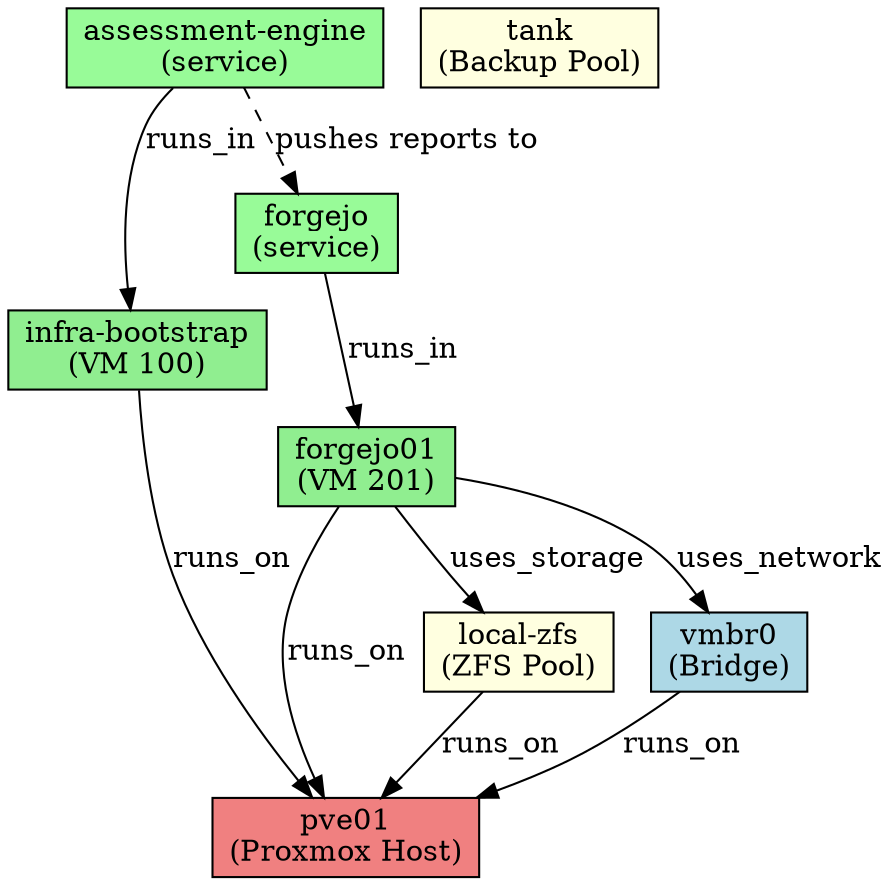

# Assessment Engine – Next Milestone Design
## Documentation Generation and Recovery Readiness System

**Status:** Design document – pre-implementation  
**Supersedes:** ROADMAP.md Phases 1–6 (all complete)  
**Informs:** ROADMAP.md Phases 7–11

---

## 1. Context and Starting Point

### What exists today

The engine collects, normalises, stores, and diffs infrastructure state across five completed phases. It produces Markdown reports and pushes them to a history repository. It ingests OpenTofu state and compares declared, configured, and observed layers. The lightweight audit package (`audit.sh` + `analyze.py`) produces a raw archive and a summary.

### What the workbook/runbook suite reveals

The twelve-stage bootstrap suite exposes three important structural facts:

1. **Stage 02 is the pivot point.** It is the first trusted observed-state artifact. Every subsequent stage—VM sizing, network design, inventory naming, recovery ordering—is supposed to consume Stage 02 outputs. In practice the operator transcribes values by hand, which is slow, error-prone, and undocumented.

2. **Stage 12 explicitly anticipates automatic generation.** The Stage 12 runbook states: *"The long-term objective is automatic generation of recovery workbooks, recovery runbooks, dependency graphs, restore sequences, and readiness reports."* The current suite is a placeholder for that future system.

3. **Every sheet follows the same pattern.** Observed Facts → Derived Decisions → Human Input Fields → Validation. That pattern maps directly onto the engine's data model. Auto-population is structurally feasible for the majority of cells.

### Guiding constraints (unchanged from charter)

- Collect facts. Do not make subjective judgments.  
- No secrets stored or retrieved by the engine.  
- Outputs are objective and evidence-based.  
- Authentication delegated to external tools.

---

## 2. Architecture Revision

### Current architecture

```
OpenTofu       → Declared State
Inventory/Ansible → Configured State
Assessment Engine → Observed State
Assessment History → Historical State
```

### Revised architecture

```
OpenTofu          → Declared State ─────────────────────┐
Inventory/Ansible → Configured State ───────────────────┤
Assessment Engine → Observed State ─────────────────────┤
Assessment History → Historical State ──────────────────┤
                                                         ↓
                              Structured Data Model (engine/model/)
                                                         ↓
                         ┌───────────┬──────────────────┐
                         ↓           ↓                  ↓
               Dependency      Documentation        Readiness
               Discovery       Generator            Scorer
               (engine/        (engine/docgen/)     (engine/
               dependencies/)                       readiness/)
                         ↓           ↓                  ↓
               Dependency    Bootstrap Docs        Readiness
               Graph JSON    Recovery Docs         Report
                             LibreOffice ODS/ODT
                                                         ↓
                                          Recovery State Repository
                                          (workbooks, runbooks,
                                           graphs, sequences)
```

The documentation generator becomes a first-class output of the engine, not a separate manual process.

### Recovery State (fifth state category)

Added alongside Declared, Configured, Observed, and Historical:

| Category | Source | Owner |
|---|---|---|
| Declared | OpenTofu state | Infrastructure team |
| Configured | Inventory + Ansible | Automation team |
| Observed | Assessment engine | Engine |
| Historical | SQLite + archive repo | Engine |
| **Recovery** | **Generated from all four above** | **Engine** |

Recovery State is the only category that is entirely generated. It is never manually authored from scratch—it is produced from the other four categories and refreshed whenever any of them changes.

---

## 3. Data Model Revisions

### 3.1 New schemas required

#### `schemas/bootstrap_data.schema.json`
Output of the Tier 1 bootstrap assessment package. Subset of the full assessment schema, structured for LibreOffice document population.

Key sections:
```json
{
  "schema_version": "1.0",
  "collection_timestamp": "",
  "hostname": "",
  "hardware": {
    "cpu": { "model": "", "cores": 0, "threads": 0, "architecture": "" },
    "memory": { "total_bytes": 0, "total_gb": 0 },
    "storage_devices": [
      { "name": "", "size_bytes": 0, "type": "", "model": "" }
    ],
    "network_interfaces": [
      { "name": "", "mac": "", "type": "", "speed_mbps": null }
    ],
    "gpu": { "present": false, "model": null },
    "iommu": { "detected": false, "dmesg_output": "" }
  },
  "proxmox": {
    "version": "", "kernel": "",
    "storage_pools": [],
    "bridges": [],
    "vms": [],
    "containers": []
  },
  "os": {
    "name": "", "version": "", "kernel_version": "",
    "installed_packages": []
  },
  "collection_method": "bootstrap_assess",
  "collection_errors": []
}
```

#### `schemas/dependency_graph.schema.json`
Directed graph of infrastructure dependencies.

```json
{
  "schema_version": "1.0",
  "assessment_id": "",
  "generated_at": "",
  "nodes": [
    {
      "id": "",
      "type": "vm|container|service|storage|network|repository|host",
      "name": "",
      "host": null,
      "attributes": {}
    }
  ],
  "edges": [
    {
      "from": "",
      "to": "",
      "relationship": "runs_on|uses_storage|uses_network|depends_on|hosts|backs_up_to",
      "required": true,
      "notes": ""
    }
  ],
  "restore_sequence": [],
  "single_points_of_failure": []
}
```

#### `schemas/recovery_metadata.schema.json`
Accumulated recovery knowledge for each named service or component.

```json
{
  "schema_version": "1.0",
  "component_id": "",
  "component_name": "",
  "component_type": "vm|container|service|repository|host",
  "recovery_priority": 0,
  "depends_on": [],
  "backup_status": {
    "backup_present": null,
    "backup_location": null,
    "last_backup_date": null,
    "backup_method": null,
    "verified": false
  },
  "recovery_procedure": {
    "documented": false,
    "procedure_location": null,
    "estimated_minutes": null
  },
  "secret_references": [
    { "secret_name": "", "store": "", "group": "" }
  ],
  "human_notes": "",
  "unresolved_items": [
    { "item": "", "why_unresolved": "", "how_to_resolve": "", "recovery_impact": "" }
  ]
}
```

#### `schemas/readiness_report.schema.json`
Recovery readiness assessment output.

```json
{
  "schema_version": "1.0",
  "assessment_id": "",
  "generated_at": "",
  "overall_score": 0,
  "grade": "ready|partial|at_risk|blocked",
  "dimensions": {
    "hardware_documentation": { "score": 0, "max": 10, "gaps": [] },
    "backup_coverage": { "score": 0, "max": 30, "gaps": [] },
    "dependency_completeness": { "score": 0, "max": 20, "gaps": [] },
    "procedure_documentation": { "score": 0, "max": 20, "gaps": [] },
    "secret_references": { "score": 0, "max": 10, "gaps": [] },
    "historical_coverage": { "score": 0, "max": 10, "gaps": [] }
  },
  "blockers": [],
  "warnings": [],
  "unresolved_items": []
}
```

### 3.2 Existing schema extensions

`assessment.schema.json` gains:
- `dependency_graph` — embedded or referenced dependency graph
- `recovery_metadata[]` — per-component recovery metadata
- `bootstrap_provenance` — records the bootstrap assessment that preceded this full assessment

`guest.schema.json` gains:
- `recovery_priority` — integer, lower = restore first
- `depends_on[]` — explicit dependency declarations (can also be auto-discovered)
- `backup_metadata` — backup status fields

---

## 4. Assessment Package Revisions

### 4.1 Tier 1: Bootstrap Assessment Package

**Design goals:** runs on a freshly installed Proxmox host, no pip, no git, no internet required. Only needs bash and python3 (both present in every Proxmox installation).

**Repository location:** `bootstrap/` (separate directory in this repo, designed to be copied as a single folder)

```
bootstrap/
  bootstrap_assess.sh      Enhanced collection script
  bootstrap_analyze.py     Structured JSON + workbook generator
  bootstrap_templates/     ODS template skeletons (binary-safe, committed)
    stage01_template.ods
    stage02_template.ods
  README.md
  CHECKSUM.sha256
```

**`bootstrap_assess.sh` — enhanced collection vs audit.sh v1:**

| Category | v1 (audit.sh) | Tier 1 (bootstrap_assess.sh) |
|---|---|---|
| CPU | lscpu | lscpu + /proc/cpuinfo |
| Memory | free -h | free -b (bytes) + dmidecode type 17 |
| Storage | lsblk | lsblk --json + smartctl (if available) + zpool list + pvesm status |
| Network | ip addr | ip addr + ip link + ip route + /etc/network/interfaces + brctl show |
| Proxmox | pveversion | pveversion + pvesh /nodes + qm list --full + pct list + pvesh /cluster/status |
| OS | — | uname -a + hostnamectl + dpkg -l + systemctl list-units |
| IOMMU | — | dmesg \| grep -e DMAR -e IOMMU |
| GPU | — | lspci \| grep -i vga |
| Installed pkgs | — | dpkg --get-selections |
| Output | archive + summary.md | archive + bootstrap_data.json + stage01.ods + stage02.ods |

**`bootstrap_analyze.py` — normalisation and document generation:**

```
Input:  audit_TIMESTAMP/ directory
Output:
  bootstrap_data.json      Structured data matching bootstrap_data.schema.json
  stage01.ods              Populated Stage 01 workbook
  stage02.ods              Populated Stage 02 workbook (the pivot document)
  summary.md               Human-readable summary (current behavior, preserved)
```

The script requires only Python 3 standard library + `odfpy` (bundled or installable via `pip install odfpy --break-system-packages`). If odfpy is absent, JSON and Markdown outputs are still produced; ODS generation is skipped with a clear message.

**Bootstrap data derivation examples:**

| Observed fact | Derived decision | Document location |
|---|---|---|
| 1 SSD detected | "ZFS single disk recommended" | Stage 01, Sheet 02, row: Filesystem |
| 2 SSDs detected | "ZFS mirror recommended" | Stage 01, Sheet 02, row: Filesystem |
| 64 GB RAM | "Recommend 8 GB for infra-bootstrap" | Stage 03, Sheet 02, row: RAM |
| Existing VM IDs present | "Next available VMID: N" | Stage 03, Sheet 02, row: VM ID |
| vmbr0 bridge present | Pre-populate bridge name | Stage 03, Sheet 03, row: Network |
| IOMMU detected | "IOMMU confirmed; passthrough available" | Stage 01, Sheet 02 |
| IOMMU absent | "IOMMU not detected; passthrough unavailable" | Stage 01, Sheet 02 |

### 4.2 Tier 2: Full Assessment Engine

The existing engine (`pae` CLI) is Tier 2. Additions for documentation generation are implemented as new subcommands on the existing CLI. No separate package is required.

---

## 5. Bootstrap Documentation Generation Design

### 5.1 Field classification

Every field in every workbook sheet falls into one of three categories:

| Category | Source | Populated by |
|---|---|---|
| **Auto-populated** | Assessment data | Engine, before operator opens file |
| **Derived** | Analysis of assessment data | Engine, using derivation rules |
| **Human input** | Cannot be discovered | Operator, after opening file |

Human input fields are highlighted in the generated ODS file and accompanied by a comment explaining what is needed and why it cannot be auto-populated.

### 5.2 Per-stage auto-population map

**Stage 01 – Proxmox Host Preparation**

| Sheet | Field | Source |
|---|---|---|
| 01 Observed Hardware | Motherboard | dmidecode type 2 |
| 01 Observed Hardware | BIOS Vendor/Version | dmidecode type 0 |
| 01 Observed Hardware | CPU Model | lscpu / dmidecode type 4 |
| 01 Observed Hardware | Total RAM | free -b / dmidecode type 17 |
| 01 Observed Hardware | SSD Count | lsblk + smartctl rotation_rate |
| 01 Observed Hardware | HDD Count | lsblk + smartctl rotation_rate |
| 01 Observed Hardware | NIC Count | ip link |
| 01 Observed Hardware | GPU Model | lspci |
| 02 Deployment Decisions | Filesystem | Derived: SSD count → ZFS recommendation |
| 02 Deployment Decisions | infra-bootstrap RAM | Derived: total RAM − 4GB host reserve |
| 02 Deployment Decisions | IOMMU | Derived: dmesg detection |
| 02 Deployment Decisions | GPU Passthrough | Derived: GPU present + IOMMU detected |
| 04 Installation Records | *all fields* | Human input (installer choices) |
| 05 Validation Results | *expected values* | Pre-populated from derivation |

**Stage 02 – Host Assessment**

| Sheet | Field | Source |
|---|---|---|
| 00 Scope | Assessment ID | Generated UUID |
| 00 Scope | Assessment Date | Collection timestamp |
| 00 Scope | Assessment Engine Version | engine version |
| 03 Observed Facts | OBS-001 through OBS-010 | Direct from bootstrap_data.json |
| 04 Infrastructure Inventory | VMs, Containers, Pools, Bridges | Proxmox API outputs |
| 05 Assessment Outputs | Archive location, SHA256 | Generated by assessment |
| 06 Recovery Findings | All IOMMU/GPU/ZFS flags | Derived from observed facts |
| 07 Stage03 Inputs | All sizing suggestions | Derived recommendations |
| 08 Validation | Expected values | Pre-populated from assessment |

**Stage 03 – Infra Bootstrap VM**

| Sheet | Field | Source |
|---|---|---|
| 01 Stage02 Inputs | All inputs | Copied from Stage 02 outputs |
| 02 VM Planning | VM ID | Next available VMID from qm list |
| 02 VM Planning | vCPU recommendation | Derived: total cores / 4 |
| 02 VM Planning | RAM recommendation | Derived: total RAM − host reserve |
| 03 Proxmox Wizard | All recommended values | Derived |
| 05 First Boot | All commands | Templated, not host-specific |

**Stages 04–12** follow the same pattern: auto-populate all fields that come from already-known values, leave human-input fields highlighted with explanatory comments.

### 5.3 Document generation pipeline

```
bootstrap_data.json
        ↓
bootstrap_analyze.py
        │
        ├── derivation_rules.py   (pure functions: observed → decisions)
        │
        ├── stage01_generator.py  (fills stage01_template.ods)
        ├── stage02_generator.py  (fills stage02_template.ods)
        └── (stages 03-12 generated by full engine via pae bootstrap-docs)
```

Each stage generator:
1. Opens the corresponding template ODS
2. Finds named cells or cells at known coordinates
3. Writes auto-populated values with normal formatting
4. Writes derived values with a distinct background colour
5. Highlights human-input cells in amber with an attached comment
6. Writes the output file

### 5.4 CLI additions

```
# Tier 1 (runs on Proxmox host, no engine installed)
./bootstrap_assess.sh                          # collect + produce JSON + ODS
python3 bootstrap_analyze.py audit_TIMESTAMP/  # re-analyze existing archive

# Tier 2 (runs on infra-bootstrap VM with engine installed)
pae bootstrap-docs --data bootstrap_data.json --output-dir docs/bootstrap/
pae bootstrap-docs --assessment assessment.json --stages 1-12 --output-dir docs/bootstrap/
```

---

## 6. Recovery Documentation Generation Design

### 6.1 Inputs

Recovery documentation is generated from the union of all available state:

```
assessment.json           (current observed state)
history.db                (historical snapshots)
dependency_graph.json     (discovered dependencies)
recovery_metadata/        (per-component recovery knowledge)
opentofu state            (declared state)
inventory/                (configured state)
```

### 6.2 Recovery Workbook structure

Generated as an ODS file. Sheets:

| Sheet | Content | Auto-populated |
|---|---|---|
| 00 Overview | Assessment date, overall readiness score, grade | Yes |
| 01 Infrastructure Summary | All hardware, VM, service, storage facts | Yes |
| 02 Dependency Order | Ordered restore sequence from dependency graph | Yes |
| 03 Component Catalog | One row per recoverable component | Mostly |
| 04 Restore Sequence | Numbered steps with commands | Yes (from deps) |
| 05 Validation Checkpoints | Per-step validation commands and expected outputs | Yes |
| 06 Backup Inventory | What exists, where, last date | Yes (from metadata) |
| 07 Readiness Gaps | Missing backups, missing docs, unresolved items | Yes |
| 08 Secret References | Secret names + store locations (never values) | Partial |
| 09 Human Notes | Free-form operator annotations | Human input |

### 6.3 Recovery Runbook structure

Generated as an ODT file. Chapters:

```
Chapter 1 – Overview and Purpose
  - Infrastructure summary (auto-populated)
  - Recovery objectives
  - When to use this document

Chapter 2 – Before You Begin
  - Prerequisites checklist (auto-populated from dependency graph)
  - Required access and secrets (names only)
  - Required physical access

Chapter 3 – Restore Sequence
  (One section per component, ordered by dependency graph)
  For each component:
    Section N.1 – Context (what this component does, what depends on it)
    Section N.2 – Prerequisites (what must be up first)
    Section N.3 – Restore Procedure (generated commands where possible)
    Section N.4 – Validation (specific checks with expected outputs)
    Section N.5 – Fallback (what to do if restore fails)

Chapter 4 – Validation Matrix
  - Full validation checklist
  - Success criteria per component

Chapter 5 – Recovery Blockers and Gaps
  - Auto-generated from readiness scoring
  - Each blocker: what is missing, why it matters, how to resolve

Appendix A – Infrastructure Reference
  - Hardware facts
  - Network topology
  - Storage topology
  - VM inventory

Appendix B – Assessment History Summary
  - Key historical changes
  - Capacity trends
```

### 6.4 Document generation pipeline

```
pae recovery-docs --input assessment.json [--history history.db] --output-dir docs/recovery/

Produces:
  docs/recovery/recovery_workbook_YYYYMMDD.ods
  docs/recovery/recovery_runbook_YYYYMMDD.odt
  docs/recovery/dependency_graph_YYYYMMDD.json
  docs/recovery/dependency_graph_YYYYMMDD.dot    (Graphviz)
  docs/recovery/restore_sequence_YYYYMMDD.md
  docs/recovery/readiness_report_YYYYMMDD.json
  docs/recovery/readiness_report_YYYYMMDD.md
```

---

## 7. Dependency Discovery Design

### 7.1 Discovery sources

Dependencies are discovered from multiple sources, correlated, and merged:

| Source | What it reveals | Method |
|---|---|---|
| Proxmox VM config | Storage pool, bridge, node | pvesh /nodes/{node}/qemu/{vmid}/config |
| Proxmox LXC config | Storage, network, node | pvesh /nodes/{node}/lxc/{vmid}/config |
| Guest running services | Service names | ansible -m service_facts |
| Guest network connections | Which hosts connect to which | ansible -m command -a "ss -tlnp" |
| Guest systemd deps | Service dependency chains | ansible -m command -a "systemctl list-dependencies" |
| Inventory host_vars | Declared dependencies | `depends_on:` key in host_vars |
| OpenTofu state | Declared resource relationships | Parsed from tfstate |
| Assessment history | Historical dependency evolution | Diff across snapshots |

### 7.2 Dependency types discovered automatically

| Relationship | Auto-discovered | Example |
|---|---|---|
| VM runs_on host | Yes | debian12 runs_on pve01 |
| VM uses_storage pool | Yes | debian12 uses_storage local-zfs |
| VM uses_network bridge | Yes | debian12 uses_network vmbr0 |
| Service runs_in VM | Yes | nginx.service runs_in web01 |
| Service depends_on service | Partial | forgejo depends_on postgresql (network connections) |
| Repository hosted_on VM | Partial | homelab-inventory hosted_on forgejo01 |
| Backup backs_up_to storage | From metadata | forgejo01 backs_up_to backup-store |
| VM declared_by opentofu | Yes | web01 declared_by module.vms.proxmox_vm_qemu.web01 |

### 7.3 Dependency graph data structure

Implemented as a directed graph in `engine/dependencies.py`:

```python
class DependencyGraph:
    nodes: dict[str, DependencyNode]
    edges: list[DependencyEdge]

    def restore_sequence(self) -> list[list[str]]:
        """Topological sort → list of restore waves (parallel-safe)."""

    def single_points_of_failure(self) -> list[str]:
        """Nodes with in-degree > 2 and no redundant path."""

    def to_dot(self) -> str:
        """Graphviz DOT format for visualisation."""

    def to_json(self) -> dict:
        """Serialise to dependency_graph.schema.json."""
```

### 7.4 Restore sequence generation

The restore sequence is derived from a topological sort of the dependency graph, then grouped into "waves" (components that can be restored in parallel within a wave):

```
Wave 1 (foundation):   pve01
Wave 2 (storage):      tank (ZFS pool), local-zfs (LVM thin)
Wave 3 (network):      vmbr0, vmbr1
Wave 4 (core services):forgejo01 (VM), keepassxc (local workstation)
Wave 5 (automation):   infra-bootstrap (VM)
Wave 6 (platforms):    forgejo (service), assessment-engine (service)
Wave 7 (repositories): homelab-infrastructure, homelab-inventory, homelab-configuration
Wave 8 (automation):   ansible, opentofu
Wave 9 (workloads):    [application VMs and services]
```

Each wave entry includes: component name, restore procedure, validation commands, estimated time, dependencies already satisfied.

### 7.5 Unknown dependencies

When a dependency cannot be auto-discovered:
1. The dependency graph node is marked `dependency_status: unknown`
2. The recovery workbook highlights the gap in amber
3. A `host_vars` snippet is generated showing how the operator can declare the dependency explicitly
4. The readiness scorer penalises the gap

---

## 8. Historical State Integration Design

### 8.1 Historical state uses

| Use case | Mechanism |
|---|---|
| Auto-populate "Previous Value" columns in drift sheets | SQLite diff query |
| Detect documentation drift (doc says X, current state is Y) | Compare generated doc fields vs current assessment |
| Track capacity trends for recovery planning | Time-series query on guest counts, storage usage |
| Reproduce a document from a past assessment | `pae recovery-docs --assessment-id N` |
| Populate "Last Known Good" state for each component | Most recent assessment where component was healthy |

### 8.2 SQLite additions

New tables added to `history.db`:

```sql
CREATE TABLE IF NOT EXISTS dependency_graphs (
    id           INTEGER PRIMARY KEY AUTOINCREMENT,
    assessment_id INTEGER REFERENCES assessments(id),
    generated_at  TEXT NOT NULL,
    data          TEXT NOT NULL   -- dependency_graph JSON
);

CREATE TABLE IF NOT EXISTS recovery_metadata (
    id             INTEGER PRIMARY KEY AUTOINCREMENT,
    assessment_id  INTEGER REFERENCES assessments(id),
    component_id   TEXT NOT NULL,
    data           TEXT NOT NULL  -- recovery_metadata JSON
    stored_at      TEXT NOT NULL
);

CREATE TABLE IF NOT EXISTS readiness_scores (
    id             INTEGER PRIMARY KEY AUTOINCREMENT,
    assessment_id  INTEGER REFERENCES assessments(id),
    overall_score  INTEGER NOT NULL,
    grade          TEXT NOT NULL,
    data           TEXT NOT NULL  -- full readiness_report JSON
    generated_at   TEXT NOT NULL
);
```

### 8.3 Documentation drift detection

After generating a recovery document from the current assessment, the engine can compare it against the most recently stored document to flag drift:

```
pae drift-check --current assessment.json --history history.db

Output:
  [DRIFT] forgejo01.memory_mb: workbook says 4096, current observation is 8192
  [DRIFT] backup_storage: previously documented, no longer observed
  [NEW]   cache01: new guest not present in recovery documentation
```

---

## 9. Recovery Readiness Scoring Design

### 9.1 Scoring dimensions

| Dimension | Max score | Description |
|---|---|---|
| Hardware documentation | 10 | All hardware fields populated in Stage 01/02 |
| Backup coverage | 30 | Each critical service has a documented, verified backup |
| Dependency completeness | 20 | All nodes in dependency graph have known edges |
| Procedure documentation | 20 | Recovery procedure documented per component |
| Secret references | 10 | Secret locations documented (names only) per component |
| Historical coverage | 10 | ≥3 historical assessments; newest < 30 days old |

### 9.2 Grade thresholds

| Score | Grade | Label |
|---|---|---|
| 90–100 | A | Recovery Ready |
| 70–89 | B | Partially Ready |
| 50–69 | C | At Risk |
| < 50 | D | Recovery Blocker |

### 9.3 Blocker classification

An item is a **blocker** (not just a gap) when its absence makes recovery impossible or unreproducible:

- Critical service has no backup and no alternative recovery path
- Root dependency (e.g. Proxmox host) has no documented rebuild procedure
- Secret reference is missing for a required credential
- Dependency graph has a cycle (infinite restore loop)

Blockers are listed first in the readiness report, each with:
1. What is missing
2. Why recovery is impossible without it
3. Minimum action to resolve it
4. Estimated effort

### 9.4 Unresolved item policy

Any field that cannot be auto-populated and has not been filled by an operator is tracked as an unresolved item. The readiness report explains each one:

```yaml
unresolved_item:
  field: "backup_location for forgejo01"
  why_unresolved: "backup_metadata not present in assessment; no Proxmox backup job detected"
  how_to_collect: "Run: pvesh get /nodes/pve01/storage with backup content type"
  recovery_impact: "Cannot restore Forgejo without knowing backup location; blocks Wave 4"
```

---

## 10. Repository Layout Revisions

### 10.1 Public repository (this repo)

```
proxmox-assessment-engine/
  bootstrap/                    NEW – Tier 1 bootstrap package
    bootstrap_assess.sh
    bootstrap_analyze.py
    bootstrap_templates/
      stage01_template.ods
      stage02_template.ods
    requirements_optional.txt   (odfpy only)
    README.md
    CHECKSUM.sha256

  collector/                    existing
  engine/
    cli.py                      extended with new subcommands
    opentofu.py                 existing
    compare.py                  existing
    dependencies.py             NEW
    readiness.py                NEW
    model/                      NEW – structured data model layer
      bootstrap.py              bootstrap_data normalisation
      dependency.py             DependencyGraph + DependencyNode
      recovery.py               RecoveryMetadata per component
      readiness.py              ReadinessReport + scoring
    docgen/                     NEW – documentation generator
      __init__.py
      ods_writer.py             ODS cell population utilities
      odt_writer.py             ODT section population utilities
      stage01.py                Stage 01 workbook generator
      stage02.py                Stage 02 workbook generator
      stages_03_12.py           Stages 03–12 workbook generator
      bootstrap_runbooks.py     Stage 01–12 runbook generator
      recovery_workbook.py      Recovery workbook generator
      recovery_runbook.py       Recovery runbook generator
    modules/                    existing
    report*.py                  existing

  schemas/
    assessment.schema.json      extended
    guest.schema.json           extended
    declared_resource.schema.json  existing
    bootstrap_data.schema.json  NEW
    dependency_graph.schema.json  NEW
    recovery_metadata.schema.json NEW
    readiness_report.schema.json  NEW

  tests/
    test_bootstrap.py           NEW
    test_dependencies.py        NEW
    test_readiness.py           NEW
    test_docgen.py              NEW
    (existing tests unchanged)
```

### 10.2 Private history repository

```
assessment-history/
  archives/                     raw audit .tar.gz files
  json/                         assessment JSON exports
  summaries/                    markdown summaries
  bootstrap/                    NEW
    bootstrap_data_TIMESTAMP.json
    stage01_TIMESTAMP.ods
    stage02_TIMESTAMP.ods
  reports/
    node/
    guest/
    comparison/
    recovery/                   NEW
      recovery_workbook_TIMESTAMP.ods
      recovery_runbook_TIMESTAMP.odt
      readiness_report_TIMESTAMP.json
      readiness_report_TIMESTAMP.md
  graphs/                       NEW
    dependency_graph_TIMESTAMP.json
    dependency_graph_TIMESTAMP.dot
    restore_sequence_TIMESTAMP.md
  history.db                    existing SQLite
```

---

## 11. Proposed Implementation Phases

### Phase 7 – Enhanced Bootstrap Assessment Package

**Scope:** Replace audit.sh + analyze.py with a production-quality Tier 1 bootstrap package.

**Deliverables:**
- `bootstrap/bootstrap_assess.sh` — comprehensive collection (all categories listed in §4.1)
- `bootstrap/bootstrap_analyze.py` — structured normalisation to `bootstrap_data.json`
- `schemas/bootstrap_data.schema.json`
- ODS generation for Stage 01 and Stage 02 (odfpy, no pip required if bundled)
- Summary Markdown preserved (backward compatibility)
- Tests: collection parsing, JSON schema validation, ODS cell population

**CLI additions:** none (package runs standalone on Proxmox host)

**Success criterion:** Run `bootstrap_assess.sh` on a freshly installed Proxmox host; get `bootstrap_data.json`, `stage01.ods`, `stage02.ods`, and `summary.md` with Stage 01 and 02 sheets ≥80% auto-populated.

---

### Phase 8 – Bootstrap Documentation Generator (Stages 03–12)

**Scope:** Extend document generation to produce the full 12-stage suite from a bootstrap assessment or full assessment.

**Deliverables:**
- `engine/docgen/` module with ODS/ODT writers
- Stage template files (03–12) in `bootstrap/bootstrap_templates/`
- Stage generators for 03–12 with field mapping tables implemented
- ODT runbook generation for all 12 stages
- `pae bootstrap-docs` CLI subcommand
- Tests: all generator modules, field population, human-input highlighting

**CLI additions:**
```
pae bootstrap-docs \
  --data bootstrap_data.json \
  --output-dir docs/bootstrap/ \
  [--stages 1-12]
```

**Success criterion:** Running `pae bootstrap-docs` on Stage 02 output produces 12 ODS + 12 ODT files, with all auto-populated fields correctly filled, human-input fields highlighted in amber with comments.

---

### Phase 9 – Dependency Discovery Engine

**Scope:** Implement automated dependency graph construction from observed state.

**Deliverables:**
- `engine/dependencies.py` — `DependencyGraph`, `DependencyNode`, `DependencyEdge`
- `schemas/dependency_graph.schema.json`
- Auto-discovery from: Proxmox VM/LXC config, guest services, inventory host_vars, OpenTofu state
- Topological sort → restore sequence (wave-based)
- Single-point-of-failure detection
- Graphviz DOT export
- `pae discover-deps` CLI subcommand
- Tests: graph construction, topological sort, SPOF detection, cycle detection

**CLI additions:**
```
pae discover-deps \
  --input assessment.json \
  [--opentofu-state terraform.tfstate] \
  --output dependency_graph.json
```

**Success criterion:** Given a full assessment, produces a dependency graph that correctly orders Proxmox → Forgejo → Assessment Engine and detects any storage or network SPOFs.

---

### Phase 10 – Recovery Documentation Generator

**Scope:** Generate recovery workbook, runbook, and restore sequence from current + historical state.

**Deliverables:**
- `engine/docgen/recovery_workbook.py`
- `engine/docgen/recovery_runbook.py`
- `schemas/recovery_metadata.schema.json`
- Recovery workbook with all nine sheets
- Recovery runbook with all five chapters + appendices
- `restore_sequence.md` — human-readable numbered sequence
- `pae recovery-docs` CLI subcommand
- Tests: workbook sheet generation, runbook chapter generation, restore sequence ordering

**CLI additions:**
```
pae recovery-docs \
  --input assessment.json \
  [--history history.db] \
  [--dependency-graph dependency_graph.json] \
  --output-dir docs/recovery/
```

**Success criterion:** Generated recovery workbook contains correct restore sequence ordered by dependency graph; all auto-populated fields match assessment data; all human-input fields are highlighted and commented.

---

### Phase 11 – Recovery Readiness Scoring

**Scope:** Score the recovery readiness of the observed environment and surface all gaps.

**Deliverables:**
- `engine/readiness.py` — `ReadinessScorer`, `ReadinessReport`, `ReadinessDimension`
- `schemas/readiness_report.schema.json`
- Scoring across all six dimensions
- Blocker vs gap classification
- Unresolved item explanations (why missing, how to collect, impact)
- Drift detection vs stored recovery documents
- SQLite tables: `readiness_scores`
- `pae readiness` and `pae drift-check` CLI subcommands
- Tests: scoring logic, blocker detection, unresolved item generation, drift detection

**CLI additions:**
```
pae readiness \
  --input assessment.json \
  [--history history.db] \
  --output readiness_report.json

pae drift-check \
  --current assessment.json \
  --history history.db
```

**Success criterion:** Readiness scorer produces a JSON report with score, grade, per-dimension breakdown, blockers, gaps, and unresolved items with resolution guidance. Drift checker correctly identifies changed fields.

---

## 12. Example Generated Bootstrap Artifacts

### 12.1 Example: `bootstrap_data.json` (excerpt)

```json
{
  "schema_version": "1.0",
  "collection_timestamp": "2024-06-01T09:23:11+00:00",
  "hostname": "pve01",
  "hardware": {
    "cpu": {
      "model": "Intel(R) Xeon(R) E-2236 CPU @ 3.40GHz",
      "cores": 6,
      "threads": 12,
      "architecture": "x86_64"
    },
    "memory": {
      "total_bytes": 68719476736,
      "total_gb": 64
    },
    "storage_devices": [
      { "name": "sda", "size_bytes": 500107862016, "type": "SSD", "model": "Samsung 870 EVO" },
      { "name": "sdb", "size_bytes": 500107862016, "type": "SSD", "model": "Samsung 870 EVO" }
    ],
    "gpu": { "present": true, "model": "NVIDIA GeForce RTX 3060" },
    "iommu": { "detected": true, "dmesg_output": "DMAR: IOMMU enabled" }
  },
  "proxmox": {
    "version": "8.1.4",
    "kernel": "6.5.11-7-pve",
    "storage_pools": [
      { "name": "local", "type": "dir" },
      { "name": "local-zfs", "type": "zfspool" }
    ],
    "bridges": [{ "name": "vmbr0" }],
    "vms": [],
    "containers": []
  },
  "derived": {
    "storage_recommendation": "ZFS mirror (2 SSDs of equal size detected)",
    "infra_bootstrap_ram_mb": 8192,
    "infra_bootstrap_vcpus": 4,
    "infra_bootstrap_disk_gb": 100,
    "next_available_vmid": 100,
    "iommu_available": true,
    "gpu_passthrough_candidate": true,
    "passthrough_note": "IOMMU confirmed. GPU passthrough feasible. Defer to later stage."
  }
}
```

### 12.2 Example: Stage 02 auto-populated observed facts (ODS sheet content)

```
Sheet: 03 Observed Facts
──────────────────────────────────────────────────────────────────────
OBS-ID   Category              Value                        Source
──────────────────────────────────────────────────────────────────────
OBS-001  CPU Model             Intel Xeon E-2236 @ 3.40GHz  lscpu
OBS-002  Physical RAM          64 GB (68,719,476,736 bytes)  dmidecode
OBS-003  Motherboard           Supermicro X11SCH-F           dmidecode
OBS-004  BIOS Version          3.3 (American Megatrends)     dmidecode
OBS-005  SSD Count             2 (500 GB each)               lsblk/smartctl
OBS-006  HDD Count             0                             lsblk/smartctl
OBS-007  GPU Model             NVIDIA GeForce RTX 3060       lspci
OBS-008  NIC Count             2                             ip link
OBS-009  Proxmox Version       8.1.4                         pveversion
OBS-010  Kernel Version        6.5.11-7-pve                  pveversion
──────────────────────────────────────────────────────────────────────

Sheet: 07 Stage03 Inputs
──────────────────────────────────────────────────────────────────────
Observation              Suggested Decision
──────────────────────────────────────────────────────────────────────
Available RAM: 64 GB     infra-bootstrap RAM: 8 GB
Available CPU: 6c/12t    infra-bootstrap vCPU: 4
2 SSDs, no VMs yet       infra-bootstrap Disk: 100 GB on local-zfs
No existing VMs          VM ID: 100 (first available)
Bridge: vmbr0            Network: vmbr0
GPU + IOMMU present      Defer GPU passthrough to Stage N
──────────────────────────────────────────────────────────────────────
```

### 12.3 Example: Stage 03 VM Planning (generated from Stage 02)

```
Sheet: 02 VM Planning
──────────────────────────────────────────────────────────────────────
Decision     Recommendation Logic                  Auto Value   Human Override
──────────────────────────────────────────────────────────────────────
VM Name      "infra-bootstrap" unless collision    infra-bootstrap  [        ]
VM ID        Next available unused ID              100              [        ]
vCPU         4 preferred (6 cores available)       4                [        ]
RAM          8 GB (64 GB total, 4 GB host reserve) 8192 MB          [        ]
Disk         100 GB on local-zfs (pool present)    100 GB           [        ]
BIOS         OVMF (UEFI standard)                  OVMF             [        ]
Machine      q35                                   q35              [        ]
Disk Bus     VirtIO SCSI                           VirtIO SCSI      [        ]
Network      vmbr0 (observed bridge)               vmbr0            [        ]
──────────────────────────────────────────────────────────────────────
```

---

## 13. Example Generated Recovery Artifacts

### 13.1 Example: `readiness_report.md` (excerpt)

```markdown
# Recovery Readiness Report
**Node:** pve01.homelab.local
**Generated:** 2024-06-15T08:00:00Z
**Overall Score:** 74 / 100
**Grade:** B – Partially Ready

## Dimension Scores

| Dimension | Score | Max | Status |
|---|---|---|---|
| Hardware documentation | 10 | 10 | ✓ Complete |
| Backup coverage | 18 | 30 | ⚠ Partial |
| Dependency completeness | 16 | 20 | ⚠ Partial |
| Procedure documentation | 16 | 20 | ⚠ Partial |
| Secret references | 8 | 10 | ✓ Mostly complete |
| Historical coverage | 6 | 10 | ⚠ 2 snapshots (need ≥3) |

## Recovery Blockers

None. All critical services have at least one documented recovery path.

## Gaps (non-blocking)

**GAP-001: forgejo01 backup not verified**
- Backup present: yes (PBS job configured)
- Last verified restore: never
- Impact: backup may exist but be unrestorable
- Resolution: run test restore to staging VM

**GAP-002: postgresql dependency unresolved for forgejo**
- Auto-discovered: forgejo01 connects to localhost:5432
- Not documented in host_vars
- Impact: dependency graph shows forgejo → [unknown], breaking restore sequence at Wave 4
- Resolution: add `depends_on: [postgresql.service]` to forgejo01 host_vars

**GAP-003: historical coverage insufficient**
- Snapshots present: 2 (need ≥3 for trend analysis)
- Newest snapshot: 4 days old (within 30-day threshold)
- Resolution: run one additional assessment

## Restore Sequence (dependency-derived)

Wave 1: pve01 (Proxmox host – root dependency)
Wave 2: local-zfs (ZFS pool), tank (backup pool)
Wave 3: vmbr0, vmbr1 (network bridges)
Wave 4: forgejo01 VM → forgejo service
Wave 5: infra-bootstrap VM
Wave 6: assessment-engine (service on infra-bootstrap)
Wave 7: Repositories restored to forgejo
Wave 8: Ansible, OpenTofu operational
Wave 9: Application workloads
```

### 13.2 Example: Recovery Runbook chapter (generated)

```markdown
## Chapter 3.4 – Restore Forgejo (Wave 4)

### Context
Forgejo is the self-hosted Git platform hosting all infrastructure 
repositories. It must be restored before any automation tooling 
(Ansible, OpenTofu) can operate, as those tools clone from Forgejo.

**Depends on (must be complete before this step):**
- Wave 1: pve01 operational ✓
- Wave 2: local-zfs storage pool online ✓
- Wave 3: vmbr0 bridge active ✓

**Required by (cannot proceed until this step is complete):**
- Wave 8: Ansible, OpenTofu (depend on Forgejo repositories)

### Prerequisites
- [ ] KeePassXC accessible (Forgejo admin credentials – Infrastructure group)
- [ ] PBS (Proxmox Backup Server) accessible at 192.168.1.50
- [ ] Backup verified present: forgejo01 – most recent: 2024-06-14

### Restore Procedure

```bash
# Step 1: Restore VM from PBS backup
qmrestore /path/to/forgejo01-backup.vma.zst 201 \
  --storage local-zfs \
  --unique

# Step 2: Start VM
qm start 201

# Step 3: Verify service
ssh automation@forgejo.homelab.local \
  "systemctl status forgejo"

# Step 4: Verify repositories accessible
curl -s https://forgejo.homelab.local/api/v1/repos/search \
  | jq '.data | length'
# Expected: >= 5 (infrastructure repos)
```

### Validation
- [ ] Forgejo web UI accessible at https://forgejo.homelab.local
- [ ] Admin login successful (credentials in KeePassXC / Git group)
- [ ] All repositories present: homelab-infrastructure, homelab-inventory,
      homelab-configuration, assessment-history, proxmox-assessment-engine
- [ ] SSH push/pull functional

### Fallback
If PBS restore fails: rebuild Forgejo from scratch using Stage 11 
runbook with repositories restored from local git bundle backups 
(see KeePassXC / Recovery group for bundle locations).

**Estimated time:** 25 minutes (restore) + 15 minutes (validation) = 40 minutes
```

### 13.3 Example: Dependency graph DOT output (excerpt)



---

## Summary of deliverables by phase

| Phase | Key deliverable | Measures success by |
|---|---|---|
| 7 | Bootstrap assess package | Stage 01+02 ≥80% auto-populated |
| 8 | 12-stage document generator | Full suite generated from one command |
| 9 | Dependency discovery | Correct restore sequence with waves |
| 10 | Recovery docs generator | Workbook + runbook contain correct data |
| 11 | Readiness scorer | Score + blockers + unresolved items + drift |

## Unchanged constraints

- The engine never stores or retrieves credentials
- All outputs are objective and evidence-based
- No recommendations are embedded without an observed-fact basis
- Human input fields are always explicitly marked and explained
- Generated documentation is reproducible from stored assessment data
- Secret values never appear in any generated document
